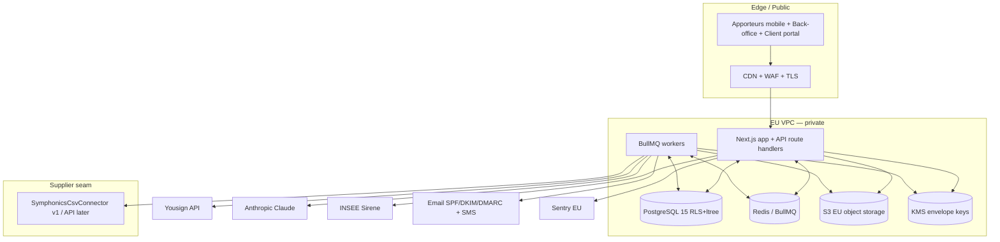

# Savewatt — Cloud & Deployment Architecture

> Follows the arch-orchestrator cloud contract. Statements labeled **Provided** (brief/decisions), **Assumption**, **Recommendation**, or **TBD**. Availability/RTO/RPO/residency/certification claims are commitments only where **Provided**.

## Executive summary & scope

- **Recommended profile:** Managed multi-tenant SaaS in the **EU** (France preferred) — **Provided** (preferences: EU hosting, dev/staging/prod separated, IaC).
- **Isolation:** logical multi-tenant via Postgres **RLS + ltree** — **Provided**. Dedicated white-label instances **conditional** (offered per contract).
- **Alternatives:** white-label isolated SaaS **conditional**; BYOC **planned**; on-prem/air-gapped **not supported in v1** (portability gaps named below).
- **Main constraints:** EU data residency; envelope KMS for IBAN/RIB/ID; immutable audit; Factur-X; 10-year contract retention — **Provided**.
- **Major risks / open:** target EU cloud provider not yet chosen (**TBD**); Symphonics API absent (**Provided** → CSV connector); binding SLA/RTO/RPO beyond the design targets not contractually set (**TBD**).

## Inputs, assumptions & requirements (traceability)

| Requirement | Value | Source |
|---|---|---|
| Region / residency | EU, FR preferred | Provided (preferences) |
| Tenancy | Multi-tenant, RLS-isolated | Provided |
| Availability target | ~99.9% app | Recommendation (not a contractual SLA — TBD) |
| RPO / RTO | 24h / 4h | Provided (preferences.dr) |
| Data sensitivity | PII + IBAN/RIB/ID (envelope KMS) | Provided |
| Integrations | Yousign, INSEE, Symphonics (CSV v1), email/SMS, ClamAV, Sentry | Provided |
| Compliance | RGPD, OWASP ASVS L2, Factur-X | Provided |
| Retention | contracts/invoices 10y; ID/RIB parameterable purge | Provided |
| Target cloud provider | Scaleway / OVHcloud / AWS eu-west-3 (Paris) | Recommendation — **TBD** which |

## Deployment profile matrix

| Profile | Status | Use case | Isolation | Owner | Upgrade |
|---|---|---|---|---|---|
| Managed multi-tenant SaaS | **supported** | Default for all régies | Logical (RLS+ltree), shared control plane | AX TECH / Savewatt ops | Rolling, central |
| Isolated white-label SaaS | **conditional** | A master needing dedicated infra/domain | Dedicated DB + namespace per tenant | Savewatt ops | Per-instance ring rollout |
| Customer-managed cloud / BYOC | **planned** | Enterprise wanting own EU account | Dedicated stack via IaC in customer account | Shared (RACI) | Customer-approved windows |
| Enterprise on-prem / air-gapped | **not supported (v1)** | — | — | — | Portability gaps below |

**On-prem portability gaps (why v1 unsupported):** managed KMS, managed Postgres, S3, and a hosted Claude endpoint have no drop-in offline equivalent yet. Adapters would be needed (self-hosted Vault+Transit, Postgres, MinIO, and a private/again-approved model endpoint or a non-AI manual extraction fallback). Recorded in `open-questions.md`.

## Logical & runtime architecture

**Component inventory:** edge CDN/WAF/TLS; web+API (Next.js); workers (BullMQ); queue/cache (Redis); primary DB (Postgres 15, RLS); object storage (S3 EU); identity (app auth + optional per-master SSO); secrets (Vault); KMS; observability (Sentry + structured logs + metrics). **Control vs data plane:** the app/API is the control plane; per-tenant data is isolated at the row level in one data plane (managed profile) or per-instance (white-label).

**Provider mapping / portable replacements:**

| Neutral | Preferred (EU) | Portable / on-prem |
|---|---|---|
| Managed Postgres | Scaleway/RDS Postgres (Paris) | self-managed Postgres |
| Object storage | Scaleway Object / S3 eu-west-3 | MinIO |
| Queue/cache | managed Redis | self-hosted Redis |
| KMS | cloud KMS | Vault Transit |
| Secrets | cloud secrets / Vault | Vault |
| Errors | Sentry EU | self-hosted Sentry |

## Environments & configuration

- **dev / test / staging / prod** separated by account/project (**Provided**); ephemeral preview per PR (**Recommendation**).
- Config hierarchy: repo defaults → env → tenant overrides (branding/workflow/grids in DB, not env). Secrets only in Vault. Feature flags for lot rollout. Seed data: 2 masters, 3 sub-régies, 10 apporteurs, JOSH case (Lot 7).
- Promotion: dev→staging→prod via CI with approvals; DB migrations gated.

## Delivery, IaC & release

- Monorepo (app + IaC + workers). CI: typecheck, lint, unit (calc + isolation **blocking**), integration, E2E (Playwright), dependency scan, SBOM, image sign/scan.
- IaC modules (Terraform/Pulumi — **TBD**): network, DB, redis, storage, KMS, app runtime, secrets, observability.
- Deploy: rolling with health gates; **expand/contract DB migrations** (Drizzle) for compatibility windows; documented rollback. Release channels: staging (continuous) → prod (approved).

## Scaling & capacity

- **Web/API:** stateless; horizontal autoscale on CPU/RPS; min 2 for HA. Sessions in cookies + DB, not memory.
- **Workers:** scale per-queue on depth (extraction, PDF, monthly close). Close job is batchable + relançable; extraction is the heaviest LLM/OCR cost — cap concurrency, backpressure via BullMQ.
- **Postgres:** connection pooling (PgBouncer); read replica for dashboards/reports when read load grows (**Assumption** on threshold — validate via load test); indexes on `org_path` (gist), foreign keys, period columns. Partition `consumption_records`/`commission_lines` by period if volume warrants (**TBD** threshold, owner: backend lead).
- **Object storage/bandwidth:** signed short-TTL URLs; PDFs and bills dominate; lifecycle to colder tier after retention windows.
- **Load-test scenarios:** monthly close at N contracts; concurrent bill extraction; dashboard fan-out. Bottleneck expectations: LLM extraction throughput, close-time DB writes. Capacity review each milestone.

## Reliability, backup & DR

- SLOs (**Recommendation**): API p95 < 500ms read; extraction < 60s p95; close completes < defined window. Health checks per service; timeouts/retries/circuit breakers on Yousign/Claude/INSEE; graceful degradation (queue if a dependency is down).
- Backups: daily encrypted, 30-day retention, **monthly restore test** (**Provided**). DR: **RPO 24h / RTO 4h** (**Provided**); multi-AZ managed DB (**Recommendation**); multi-region **TBD**.
- Incident ownership + runbooks (**TBD** on-call rota).

## Security & network

- Ingress via CDN/WAF/TLS 1.2+; private VPC for app/DB/redis; egress allowlist to Yousign/Anthropic/INSEE/mail. Workload identity for cloud resources; least-privilege RBAC; privileged access audited.
- Encryption: TLS in transit; AES-256 at rest; **application envelope encryption (KMS)** for IBAN/RIB/ID/API keys (**Provided**). Tenant isolation = RLS (managed) / dedicated (white-label). Immutable hash-chained audit log. Upload AV (ClamAV) + MIME-by-content + signed URLs. Dependency/image scanning; patch cadence; pentest pre-prod + annual (**Provided**).

## White-label architecture

- **Configuration (no fork):** logo, charte tokens, PDF templates, workflow, grids, message templates, subdomain, custom domain + managed TLS, branded email sender (per-master SPF/DKIM), optional SSO (SAML/OIDC), FR/i18n. All per-`organizations` row.
- **Dedicated instance (conditional):** a master needing physical isolation → separate DB + namespace, provisioned by IaC, ring-rollout upgrades. Prefer configuration; fork only on contractual isolation need.
- Data export/deletion per tenant; offboarding = export + parameterable purge with proof.

## Enterprise on-prem / air-gapped

**Status: not supported in v1** (**Provided** decision — SaaS EU only). If pursued later: Kubernetes or compose profile; prerequisites (CPU/mem/storage/DNS/TLS/LB/Postgres/object store/identity); signed images/charts + SBOM + offline bundle; install/preflight/upgrade/rollback/backup-restore/diagnostics; customer SSO/SMTP/storage/SIEM/proxy; telemetry-off + zero-egress + a private or disabled model endpoint (extraction falls back to manual). Cloud-only gaps (KMS, hosted Claude, managed DB/storage) get the adapters listed above or the profile stays unsupported. RACI to be authored then.

## Operations & observability

Structured JSON logs (no clear PII), metrics (queue depth, extraction confidence, close duration, connector health), Sentry, synthetic checks on login + portal + webhooks, correlation IDs, audit events, SLO burn alerts, runbooks, escalation. `/health` aggregates DB/redis/queues/connectors.

## Cost & FinOps

Main drivers: **LLM extraction** (per-bill tokens/OCR), managed Postgres, object storage growth (bills/PDFs, 10y retention), egress. Controls: template-context caching, Sonnet-default with Opus escalation only on low quality, page caps; storage lifecycle tiers; per-tenant attribution tags for future white-label premium billing. On-prem/BYOC shift infra cost to customer (future). Budgets + alerts (**TBD** thresholds).

## Roadmap & acceptance evidence

Foundation (Lot 0 IaC + envs) → managed SaaS staging (Lots 1–4) → prod hardening + pentest (Lot 7) → white-label enablement (post-v1) → BYOC (planned) → on-prem (evaluated later). Each milestone: prerequisites, owner, deliverables, validation tests (isolation + calc + E2E), rollback evidence, exit criteria. Open decisions → `open-questions.md`; accepted → `decisions.md`.
